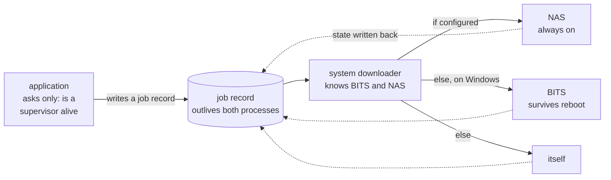

# abstractions

**Your download shouldn't stop because you closed the laptop.**

A standard library of *interfaces*, not implementations — SLF4J's idea applied to
the things local-AI tools each rebuild badly and privately: downloading, storing,
and knowing what work is in flight.

```go
a, _ := abstraction.Discover()

ui.Bind(a.Download().Jobs())            // everything in flight, including
                                        // work that predates this process
job, _ := a.Download().Get(url, dest)   // returns now; outlives this program
```

That is the whole integration. On a machine with a NAS set up, those bytes are
fetched by the NAS. On a Windows machine without one, by BITS. On a machine with
neither, by the process you are standing in. **The application does not branch on
any of it and contains no path, no hostname and no flag.**

It does not hold a store, a runner or a connection either. An earlier version of
this snippet had the application call `Discover()`, carry a `*job.FileStore`, and
switch on a `Handoff` — three concepts and a branch, all of them decisions this
design exists to take away. Nobody calls `LoggerFactory.discover()`, and nobody
asks a logger whether an appender is attached before deciding whether to log.

---

## The problem

Every local-AI tool ships its own downloader, and every one of them loses a 40 GB
model when the machine sleeps. Every tool keeps its own model store, so the same
weights sit on disk four times under four different names.

Measured on one ordinary machine:

| store | size | names files by | dedupable? |
|---|---:|---|---|
| LM Studio | 44 GB | filename only | **no** |
| Lemonade | 26 GB | content hash | yes |
| Ollama | 23 GB | content hash | yes |
| HuggingFace cache | 23 GB | content hash | yes |

**116 GB, four stores, none of which know the others exist.** Not because the
problem is hard — because there is no shared *interface*, so each tool solves it
privately and none of them solve it well.

---

## How it works

An application asks for bytes. It never chooses who fetches them.



**Two hops, each ignorant of the next.** The application knows only whether a
system downloader exists. That service decides whether the work goes to a NAS,
to the OS transfer service, or nowhere at all. Exactly as a library that logs
knows about a facade and a default, and nothing about which collector the sinks
point at.

What connects them is not a call between two live processes. It is **a record of
the work that outlives both of them** — which is why a download survives the
program that started it, the machine going to sleep, and being picked up by a
different implementation in a different language on a different computer.

Where that record lives is a **binding, not the design**. Today it is files on
disk, because that is the binding that needs no service running, no port open and
no dependency, and it still works when every process is dead. A real deployment
wants a service and binary calls, and the interface must not be able to tell the
two apart. Right now it can — see *Honest state*.

---

## See it

```console
$ dl tiers
store        C:\Users\reinis\.abstraction
supervisor   jobd@CoffeeMachine:6252
             which itself delegates to "nas"

$ dl https://.../Qwen2.5-0.5B-Instruct-IQ2_M.gguf -o D:/models/
  job       1788378755276-b93cfa9b6f076a00b995
  left for  jobd@CoffeeMachine:6252

The system downloader has it. This program can exit and the download
will not stop.

running     nas      42.8 MiB / 313.4 MiB
```

Close that terminal. Open a new one:

```console
$ dl list
running     nas      168.2 MiB / 313.4 MiB   Qwen2.5-0.5B-Instruct-IQ2_M.gguf
```

**Nothing `dl` prints comes from its own memory.** It reads the record, exactly
as any other process would — which is why a console pull shows up in an
application's download list, and why restarting a server does not empty it while
the partial files are still on disk. Every tool in the survey fails this.

---

## What is proven, and how

Not assertions — these were run.

**A 313 MB model fetched by a Synology NAS and delivered to a Windows PC**, sha256
matching what HuggingFace published. The NAS runs the same binary, over the same
job store, with the same lease protocol. There is no NAS-specific code in this
repository.

**A real download killed with `SIGKILL` mid-transfer**, resumed by a separate
invocation from the byte the dead process had *proven* — not the byte it had
written:

```
bytes on disk:   61163581
bytes PROVEN:    52824170
```

That gap is the design. The dead process wrote more than it had checkpointed,
nothing vouches for the difference, so the resume discards it.

**`O_EXCL` is genuinely exclusive over SMB** to that Synology — the assumption the
whole lease protocol rests on, tested rather than assumed.

**Go and Python finishing each other's downloads.** Not "both can download" —
one starts a transfer, is *killed* partway through so it never releases its lease
or writes a final checkpoint, and the other resumes from the last proven byte and
delivers a file whose digest matches:

```
Go starts, Python finishes
        go stopped with 1081344 of 4194304 bytes proven
  PASS  go->python: go started it, python finished it, digest matches

Python starts, Go finishes
        python stopped with 1048576 of 4194304 bytes proven
  PASS  python->go: python started it, go finished it, digest matches
```

That is the test that separates an abstraction from a file format with one
reader. `bash scripts/xlang-download.sh`.

---

## The layers

```
  abstraction  the one entry point. a.Jobs(), a.Download(), a.Log()
    ↓          discovered once; an application holds nothing else
  model        AI-specific: quantisations, published digests, model stores
    ↓          builds a download.Spec and hands it down
  download     bytes: artifact · sources · sink. Knows nothing about AI
    ↓
  job          a handle to work happening somewhere else
    ↓
  transport    how a call reaches whoever executes it — the BINDING
```

The bottom row is the one that was missing longest. Files in a directory is a
binding of it, not the design; a service with binary calls is another. Nothing
above `job` may name either, and today only one exists, so that layer is a
declared boundary rather than a finished piece of work.

Dependencies point one way — `model` imports `download` imports `job`, and
nothing imports `model`. The rule that keeps it honest is that the generic layer
must contain no word from the specific one, which is a one-line audit:

```bash
grep -rniE "model|gguf|huggingface|ollama" download/go --include=*.go
```

It came back dirty twice. `jobd` read an environment variable called
`MODELGET_STORE` — the generic supervisor configured by a name borrowed from a
consumer above it — and the NAS binding delivered into a directory called
`models`. Both fixed; the grep is how they were found.

Three hits remain and are deliberate: `MODELGET_STORE` and `~/.modelget` are
honoured as legacy aliases, because stores exist on disk under them and silently
ignoring them would orphan work in flight.

---

## What is actually here

| | state |
|---|---|
| **abstraction** | Go. The entry point: `Discover()` once, then `Jobs()`, `Download()`, `Log()`. An application holds nothing else. [`job.thrift`](job/job.thrift) states the job contract in a notation that is nobody's language |
| **job** | Go **and Python**, proven handing work to each other |
| **download** | Go **and Python**, proven finishing each other's downloads. HTTP, file, Windows BITS, NAS — 4 transports, 1 interface |
| **model** | Go. `modelget`: resolve a reference, get the digest before any byte moves |
| **logging** | Go. Not a facade — `slog` already is one. The part that leaves the process |
| **config** | Go. Machine-level discovery, so nothing needs configuring per application |
| **vault** | Go, working, not integrated with anything |
| **forks/lemonade** | C++. A **third** implementation, inside a 130k-line app that didn't ask for it. Its own repo — [`ReinisLusis/lemonade@abstraction-job-store`](https://github.com/ReinisLusis/lemonade/tree/abstraction-job-store). What it taught the design: [`docs/integrating.md`](docs/integrating.md) |
| **deploy/nas** | A Docker image built without Docker. One file inside it |

```
dl        the generic downloader        download/go/cmd/dl
modelget  the AI one, built on it       model/go/cmd/modelget
jobd      the system downloader         download/go/cmd/jobd
```

### Honest state

**This is not ready to ship**, but it is no longer only a design.

`job` and `download` each have **independent implementations that pass the same
tests and hand work to each other** — the bar this project set for calling
something an abstraction, and it is met. `job` has three: Go, Python and C++.
`download` has three, though the C++ one only reads. `logging` has two.
`storage` has Go and C++. `model` and `config` are Go only.

C++ was the interesting one — not garbage-collected, and its JSON is not
ergonomic, which is where a file-format-shaped assumption would have surfaced.
None did. It lives here, in `job/cpp` and `storage/cpp`, alongside its siblings;
it used to live inside the Lemonade fork, which made it a facade named after one
of its own consumers.

And it now runs inside an application that did not ask for it. Lemonade — 130k
lines of C++ — builds with the job store compiled in, and answers
`/api/v1/downloads` from records on disk instead of from its own memory:

```console
$ jobctl submit --kind download --spec '{...}'      # Go writes the record
$ curl localhost:8123/api/v1/downloads              # C++ renders it
{ "model_name": "Qwen2.5-0.5B-Instruct", "bytes_total": 328597408,
  "status": "paused", "running": false }
```

Read back from the same directory by Python. Three languages, one contract, one
directory, one real application.

What is genuinely missing:

- **Both adopters are ours.** A fork is not adoption, and neither is a custom
  node we wrote. The Lemonade fork and the ComfyUI node were both built here.
  Nobody outside has chosen this, and until somebody does, every claim about
  the interface being general is a claim about our own taste.
- **No upstream PR.** The Lemonade change is committed in the fork and has never
  been proposed to the people who maintain it. This is the single thing most
  worth doing next, because it is the only one that can produce an adopter who
  is not us.
- **One C++ test cannot be rebuilt.** `test_download_layer.exe` runs and passes,
  but its source was left in a temp directory that no longer exists. A test
  nobody can rebuild is an artifact, not a test.
- **`model` is barely exercised.** One implementation, one caller, and the least
  evidence of any layer here.
- **The two-binding test now runs, and passes on three.** *The same application,
  unchanged, on two bindings* is what decides whether this is an abstraction. One
  body of assertions — exclusive claim, rising epoch, stale writes refused,
  intent without a lease, a paused job kept out of sweeps, a successor inheriting
  the proven prefix — executes against files in a directory, a service over a
  socket, and a map in memory, and not one line of it knows which.

  The memory binding is the one that answers the fair objection: a socket in
  front of a `FileStore` is a transport swap, not a second implementation. It
  shares no code with `FileStore`, so the semantics are written twice and agree.

  What that does **not** yet show: the layers above `job` have only ever run on
  the file binding, because `download` needs a local area for partials and asks
  for it through `job.Scratch`, which the other two correctly decline. So the
  contract is proven substitutable; the stack on top of it is not.
- **Delegation is proven end to end, once.** A 112 MB model pulled from the
  Lemonade UI was fetched *by the NAS*, delivered to Lemonade's cache at exactly
  the right size, and shown as `completed` — while the same UI, with the
  supervisor stopped, fetched the neighbouring variant in-process and recorded
  it as `here`. Same application, same code path, different fetcher, and it
  never knew which. Pause and cancel were proven separately against a
  multi-gigabyte transfer.

  Not yet shown: that mid-flight progress from a delegate reaches the UI on a
  transfer short enough to finish inside one checkpoint interval. The 112 MB run
  sat at 0% and jumped to 100%.
- **A delegated transfer is serial.** The NAS fetches the whole artifact before
  the local machine copies any of it, so the wall clock is the sum of both legs.
  Fixing that needs piecewise digests before it needs any code — see
  [`docs/incremental-delivery.md`](docs/incremental-delivery.md).

> An earlier version of this file said the fork was "written but uncompiled" and
> that there was "no third language". Both were wrong — it had been compiled in
> August and never re-checked. The claim was repeated into a commit message and a
> published page before anyone looked.
>
> This section then went stale a second time, in the opposite direction: it went
> on describing `download.StoreRoot()`, `ErrCancelNeedsOwner` and a schema
> integer for weeks after all three were gone, and listed layers as Go-only that
> had two implementations. Overstating the limits is the same failure as
> overstating the progress. **Re-read this section whenever a layer changes.**

---

## Rules

Earned, each of them, by a specific failure in this repository.

- **No interface until two implementations exist** — and find the second one *in
  the world* rather than inventing it.
- **Prefer adopting or wrapping over building.** Say so plainly when the honest
  answer is "write it". BITS was adopted. `slog` was adopted. `aria2` was refused
  on licence, and the reasons are written down.
- **An interface changes on a failing real case, never on an argument.**
  `Finalize` gained a parameter because a NAS could not discover a local
  destination from a handle — not because it looked nicer.
- **Done means it runs on a machine you do not own**, from the written
  instructions.
- **Every task ends in a pasted terminal transcript.** A failure is a result.
- **Documentation does not grow faster than tested code.**
- **A proposal needs prior art, not permission.** An earlier rule here said the
  word "standard" was off-limits until somebody outside had implemented one.
  That is a purity test rather than a method — it makes adoption a precondition
  for the thing people would adopt, and it discards the one form of evidence
  actually available up front. What a proposal owes is a demonstration that
  independent systems already converged on the shape: BitTorrent v2 and
  HuggingFace Xet both describe a transfer as a content identity plus places to
  get it; Temporal hands a retried worker its predecessor's checkpoint rather
  than restarting it; BITS forces two-phase completion. Convergence is the
  argument that a design is not invented. Adoption is the outcome, and it is
  still not claimed.

---

## Start here

`docs/origin.txt` — the owner's own statement of the problem. Every derived
planning document this project has produced has eventually drifted from it.

[`SCOPE.md`](SCOPE.md) — what this is a library of, which services qualify, and
in what order. Read it before proposing a new layer; it exists to say no.

Then [`job/README.md`](job/README.md), which is the shortest path to what is
actually being built, or [`download/README.md`](download/README.md) for the layer
most of the work is in.

Each abstraction's README is the documentation: what it is for, the rules and why
each exists, what is proven, and what is not. That is the deliverable, not a side
effect of it.

## What was here before

A seven-part "standards program": eight specifications, twenty-one decision
records and an eighteen-worker simulated organisation, built in eleven hours,
none of it tested against anything outside itself. Deleted on 2026-08-16,
recoverable at tag `pre-salvage`. `docs/review/` is the adversarial review that
took it apart, and it is worth more than what it reviewed.
